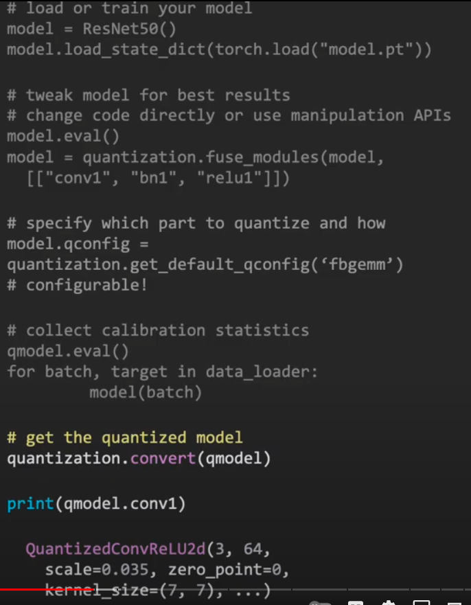

# Quantiation

- [Quantiation](#quantiation)
- [References](#references)
- [Intro](#intro)
- [Eager mode - 3 turn-key workflows](#eager-mode---3-turn-key-workflows)
- [Pytorch Quanitzation Components](#pytorch-quanitzation-components)
- [Workflow 1: Post Training Dynamic Quantization](#workflow-1-post-training-dynamic-quantization)
- [Workflow 2: Post Training Static QUantization](#workflow-2-post-training-static-quantization)
  - [Step 1 of 4: Modify model](#step-1-of-4-modify-model)
  - [Step 2 of 4: Prepare and Calibrate](#step-2-of-4-prepare-and-calibrate)
  - [Step 3 of 4: Convert](#step-3-of-4-convert)
  - [Step 4 of 4: Deploy](#step-4-of-4-deploy)
- [Workflow 3: Quantization Aware Training](#workflow-3-quantization-aware-training)
  - [Step 1 of 4: Modify Model](#step-1-of-4-modify-model-1)
  - [Step 2 of 4: Prepare and Train](#step-2-of-4-prepare-and-train)
- [Accuracy](#accuracy)

# References

1. [Deep dive intp Pytorch Quantization - youtube](https://www.youtube.com/watch?v=c3MT2qV5f9w)

2. [Introduction to Quantization on pytorch](https://pytorch.org/blog/introduction-to-quantization-on-pytorch/)  

3. [Torch quantization design proposal](https://github.com/pytorch/pytorch/wiki/torch_quantization_design_proposal)

4. [Quantization in practise - Eager mode vs FX mode **NEW**](https://pytorch.org/blog/quantization-in-practice/) 

# Intro

PyTorch provides two modes of quantization: Eager Mode Quantization and FX Graph Mode Quantization.

Eager Mode Quantization is a beta feature. User needs to do fusion and specify where quantization and dequantization happens manually, also it only supports modules and not functionals.

FX Graph Mode Quantization is an automated quantization framework in PyTorch, and currently it’s a prototype feature. It improves upon Eager Mode Quantization by adding support for functionals and automating the quantization process, although people might need to refactor the model to make the model compatible with FX Graph Mode Quantization (symbolically traceable with torch.fx). Note that FX Graph Mode Quantization is not expected to work on arbitrary models since the model might not be symbolically traceable, we will integrate it into domain libraries like torchvision and users will be able to quantize models similar to the ones in supported domain libraries with FX Graph Mode Quantization. For arbitrary models we’ll provide general guidelines, but to actually make it work, users might need to be familiar with torch.fx, especially on how to make a model symbolically traceable.

This document covers **EAGER MODE**. 

# Eager mode - 3 turn-key workflows

1. Post training dynamic quantization

2. Post training static quantizaiton

3. Quantization aware training

4. Newer guide frin reference 4
5. 


# Pytorch Quanitzation Components

float_val = (uint8_val - zero_point) * scale

1. [Quantizer tensor](https://github.com/pytorch/pytorch/wiki/Introducing-Quantized-Tensor): Same as tensor but also has zero point and scalr factor parameters. ***NOTE: Right now it supports qint8, quint8 and qint32 data types which corresponds to int8, uint8 and int32 respectively, we will add support later for qint16 as well.***

2. Quantization operations: 

    a. There are 2 methods to get a quantized tensor from non-quantized tensor: **torch.quantize_per_tensor(/channel)**: scale factor per tensor or per channel of tensor

    b. Operations that operate on quantized tensors: **torch.ops.quantized.\***

    c. **torch.nn** modules for the non-quantized are in **torch.nn.quantized.\*** and **torch.nn.quantized.dynamic.\*** modules

    d. Tools to work throught he workflows live in pytorch under **torch.quantization.\*** namespace. Some examples are: **torch.quantization.Observer** (which is used to determine the scale factors) and **torch.quanztization.FakeQuantize** (which is used to simulate quantize in QAT workflow)

    e. Extensible APIs: Can have your own observers, layers, quantization techniques, partial quantization. 

3. Quantization workflows 

# Workflow 1: Post Training Dynamic Quantization

1. How: Tweak the model with one line API

2. What: Quantize weights once, activations at runtime

3. Good for LSTMs/Transformers and MLP wioth small batch sizes

4. Savings: 2x faster compute, 4x less memory

5. The quantized model is done in one line. It runs faster than FP32 model. 

    a. Weights: Weights are known ahead in time. The API creates right scale factors for the weights and quantized tensors are created. 
    
    b. Activations: When inference is run, the range of values are looked at runtime and scale factors are chosen dynamically at runtime. Scale factors are computed and applied at each given time. 

6. Backend is either **FBGEMM**(x86) or **QNNPACK**(ARM)
   

 

# Workflow 2: Post Training Static QUantization

1. How: Tweak model, calibrate on data, and convert the model

2. What: Quantize weights and activations for entire emodel or submodules base don what it saw in model and in calibration dataset

3. Good for: CNNs (if the accuracy drop is acceptable)

4. Savings: 1.5-2x faster compute, 4x less memory

5. Calibration process looks at the range, store statistics and chooses right scale factors. 

6. Four steps are described below

 

## Step 1 of 4: Modify model

1. Use modules for all operations with state

2. Explicitly control where actuvations are quantized or dequantizd

3. Fuse operations prior to quantization for performance and accuracy benefits.

4. In fig below, model.eval() removes bact norm for example. fuse_modules() fused batch norm and conv, bn and relu to a single node

5. Can choose to quantize only subset of model using to/from APIs (check ocumentaiton)

 

## Step 2 of 4: Prepare and Calibrate

1. Specify which parts of the model need to be quantized

2. Sepcify how to collect statistics (observers)

3. **qconfig()** is where you specify which modules in the model you want to quantize to quantize and how. Can also choose exact form of quantization, eg. whether you want a constrant that bias is always 0 or non-0, etc. On CPU, it uses **fbgemm**, that has default qconfigs. Similar set of default parameters for **qnnpack**.

4. **quantization.prepare()** functions adds observers. and then calibrate. Can change MinMaxObserver to something else depending on what gives best accuracy.

 

## Step 3 of 4: Convert

1. How: call **quantization.convrt()**

2. Converts operations from fp32 to int8 arithmetic. 

3. It replaces operations to quantized operations. 

 


## Step 4 of 4: Deploy

1. How: call **script()** and save (for different backend versions, use a different save)

2. What: script the model and save the scripted model so that it can be deployed to different backends

 


# Workflow 3: Quantization Aware Training

1. Fine tune the network in a way that it learns when inpouts and weights are quantized. (may also learn scale factors)

2. Emulate quantization by quantizing and de-quantizing in succession (values are still in floating point but with reduced precision)


2. Equations

```
    x_out   = FakeQuant(x) 

            = DeQuant(Quant(x)) 
    
            = s * (Clamp(round(x/s) - z) + z))
```

3. (top): Fake Quantizer - shows quantization of output values. (bottom) Approximation for purposes of derivative calculations 

 

4. Very similar to **Post Training Static Quantization** as scribed in Workflow 2. 

    a. Use modules for all operations with state. 

    b. Explicitly control where activations are quantized and dequantized. 


## Step 1 of 4: Modify Model

1. Fuse operations prior to quantization for performance and accuracy benefits. (Batch norm fused with conv prior to training to provide hi quantization accuracy.

 
 

## Step 2 of 4: Prepare and Train

1. How: Specify which parts o fmodel need to be quantized. Specify how to collect statistics (Fake Quant)

2. Batch Norm is handled differently for trianing. 

3. **prepare_qat()** instead of **prepare()** - this puts fake quant instead of observers.

4. Rest of workflow is identical to PTQ, i.e. **convert** and **deploy**. 

5. This workflow **quantizes** and **finetunes**.

 
 

# Accuracy


1. Pattern they saw: For full size CNN modes, PTQ per channel is enough to give good accuracy. 
   
2. With reduced parameter MobileNet type networks (perhaps with fewer weights in network) seem to need QAT.

